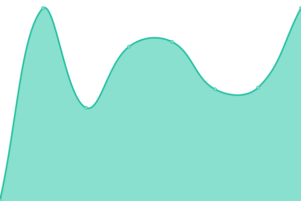

# [📈 Live Status](https://uptime.tiamat.tech): <!--live status--> **🟩 All systems operational**

This repository contains the open-source uptime monitor and status page for [Tiamat Tech](https://tiamat.tech), powered by [Upptime](https://github.com/upptime/upptime).

With [Upptime](https://upptime.js.org), you can get your own unlimited and free uptime monitor and status page, powered entirely by a GitHub repository. We use [Issues](https://github.com/Tiamat-Tech/uptime/issues) as incident reports, [Actions](https://github.com/Tiamat-Tech/uptime/actions) as uptime monitors, and [Pages](https://uptime.tiamat.tech) for the status page.

<!--start: status pages-->
<!-- This summary is generated by Upptime (https://github.com/upptime/upptime) -->
<!-- Do not edit this manually, your changes will be overwritten -->
<!-- prettier-ignore -->
| URL | Status | History | Response Time | Uptime |
| --- | ------ | ------- | ------------- | ------ |
|  [Tiamat Tech](https://tiamat.tech) | 🟩 Up | [tiamat-tech.yml](https://github.com/Tiamat-Tech/uptime/commits/HEAD/history/tiamat-tech.yml) | 

 130ms
     
 | 

<a href="https://uptime.tiamat.tech/history/tiamat-tech">100.00%</a>
    

|  [Digital Garden](https://vortex.name) | 🟩 Up | [digital-garden.yml](https://github.com/Tiamat-Tech/uptime/commits/HEAD/history/digital-garden.yml) | 

 83ms
     
 | 

<a href="https://uptime.tiamat.tech/history/digital-garden">100.00%</a>
    

|  [Tutorials Domain](https://avortex.online) | 🟩 Up | [tutorials-domain.yml](https://github.com/Tiamat-Tech/uptime/commits/HEAD/history/tutorials-domain.yml) | 

 133ms
     
 | 

<a href="https://uptime.tiamat.tech/history/tutorials-domain">100.00%</a>
    

|  [Robert Bratucu Blog](https://drbratucu.ro) | 🟩 Up | [robert-bratucu-blog.yml](https://github.com/Tiamat-Tech/uptime/commits/HEAD/history/robert-bratucu-blog.yml) | 

 140ms
     
 | 

<a href="https://uptime.tiamat.tech/history/robert-bratucu-blog">100.00%</a>
    

|  [Corina Topor Blog](https://corinatopor.com) | 🟩 Up | [corina-topor-blog.yml](https://github.com/Tiamat-Tech/uptime/commits/HEAD/history/corina-topor-blog.yml) | 

 101ms
     
 | 

<a href="https://uptime.tiamat.tech/history/corina-topor-blog">100.00%</a>
    

|  [Test for HEAD](https://www.google.com) | 🟩 Up | [test-for-head.yml](https://github.com/Tiamat-Tech/uptime/commits/HEAD/history/test-for-head.yml) | 

 32ms
     
 | 

<a href="https://uptime.tiamat.tech/history/test-for-head">100.00%</a>
    

|  Secret Site | 🟩 Up | [secret-site.yml](https://github.com/Tiamat-Tech/uptime/commits/HEAD/history/secret-site.yml) | 

 118ms
     
 | 

<a href="https://uptime.tiamat.tech/history/secret-site">100.00%</a>
    

<!--end: status pages-->

[**Visit our status website →**](https://uptime.tiamat.tech)

## 📄 License

- Powered by: [Upptime](https://github.com/upptime/upptime)
- Code: [MIT](./LICENSE) © [Tiamat Tech](https://tiamat.tech)
- Data in the `./history` directory: [Open Database License](https://opendatacommons.org/licenses/odbl/1-0/)
